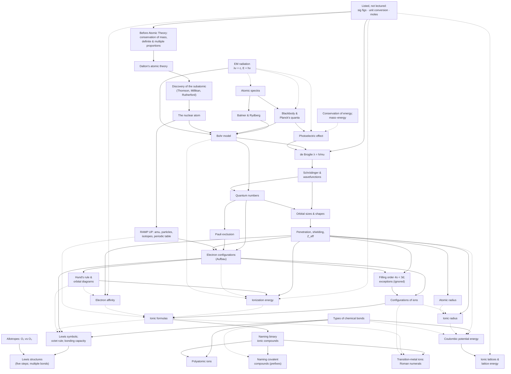

# Course Concept Map

The conceptual dependency structure of THIS course, built only from supplied
materials by `/ingest-course`. Never populate it from a generic chemistry
syllabus or force it into a textbook's chapter order. A concept appears here only
if it appears in lecture, notes, or review material; homework-only concepts go in
the last section.

**Status:** Built from Day 1–8 lecture slides (all 187 pages inspected). No notes,
review, or homework supplied yet. Last updated 2026-09-25 (Day 8 added).

## How to read this map

- `A → B` means B depends on A (A is a prerequisite for B).
- Each edge has a basis:
  - **SOURCE-DERIVED** — the materials connect them explicitly (e.g. "recall from
    Day 3…", or B's worked example uses A) — cite it
  - **INFERRED** — B cannot be done without A, but the materials don't say so
- Concept names match the `##` concept headings in `materials/COURSE_INDEX.md`.
- Page citations: `Day N p.X` = `materials/lectures/Day N Lecture Slides.pdf`, PDF page X.

## Units (in course order)

Units follow the professor's own chapter slides (Ch. 1 → 4). Lectures run
continuously, so one lecture can span two units.

### Matter and Atomic Theory (Ch. 1) — Day 1
- Before Atomic Theory: Conservation of Mass, Constant Composition, and Multiple Proportions (Day 1 p.8–13)
- Dalton's Atomic Theory (Day 1 p.14)
- Conservation of Energy and Mass–Energy (Day 1 p.15)
- Listed but Not Lectured: Ch. 1 §1.3–1.8 and Ch. 2 §2.2–2.5 Topics (Day 1 p.6–7, p.16–17; Day 2 p.4–5, p.24). Includes significant figures, unit conversion and dimensional analysis, moles and molar mass, and nuclide symbols. Printed in italic and delegated to RAMP UP ([INFERRED]); used later without being taught.

### Atoms, Ions, and Molecules (Ch. 2, §2.1 lectured) — Day 1 p.16 – Day 2 p.24
- The Discovery of the Subatomic: Thomson, Millikan, and Rutherford (Day 1 p.18–20; Day 2 p.6–18)
- The Nuclear Atom (Day 2 p.17–20)
- RAMP UP Content: Atomic Mass Units, Subatomic Particles, Isotopes, and the Periodic Table (Day 2 p.21–24)

### Atomic Structure: Explaining the Properties of Elements (Ch. 3) — Day 2 p.25 – Day 7 p.11
- Electromagnetic Radiation: Wavelength, Frequency, and Energy (Day 2 p.28–30; Day 3 p.12)
- Atomic Spectra: The Solar Spectrum, Emission, and Absorption (Day 2 p.31; Day 3 p.7–11)
- Blackbody Radiation and Planck's Quantization of Energy (Day 3 p.11–17)
- The Photoelectric Effect (Day 3 p.18–19)
- The Hydrogen Spectrum: Balmer and Rydberg Equations (Day 3 p.21; Day 4 p.6–8)
- The Bohr Model of the Hydrogen Atom (Day 4 p.3, p.8–10; Day 6 p.8)
- The de Broglie Equation: Wave–Particle Duality of Matter (Day 4 p.11–17)
- The Schrödinger Equation and Wavefunctions (Day 4 p.18; Day 5 p.7–9)
- Quantum Numbers (n, ℓ, m_ℓ, m_s) (Day 5 p.10–16)
- The Pauli Exclusion Principle (Day 5 p.15)
- Sizes and Shapes of Atomic Orbitals (Day 5 p.17–20)
- Electron Configurations: The Aufbau Principle and Notation (Day 6 p.6–17)
- Penetration, Shielding, and Effective Nuclear Charge (Z_eff) (Day 6 p.12–13, p.18)
- Hund's Rule and Orbital Diagrams (Day 6 p.15–17)
- Filling Order beyond n = 2 (4s before 3d) and Exceptions to the Filling Rules (Day 6 p.18–20; Day 7 p.6). The exceptions are explicitly excluded: "We will *completely ignore this* in this class" (Day 7 p.6).
- Electron Configurations of Ions (Day 6 p.21–23)
- Periodic Trends: Atomic Radius (Day 6 p.24–26; Day 7 p.7)
- Periodic Trends: Ionic Radius (Day 7 p.8)
- Periodic Trends: Ionization Energy (Day 7 p.9–10)
- Periodic Trends: Electron Affinity (Day 7 p.11)

### Chemical Bonding (Ch. 4) — Day 7 p.12 – Day 8 p.30 (in progress)
- Primary Types of Chemical Bonds (Ionic, Covalent, Metallic) (Day 7 p.14; Day 8 p.11, p.14–15)
- Electrostatic (Coulombic) Potential Energy (Day 7 p.15)
- Ionic Lattices and Lattice Energy (Day 7 p.16–17)
- Formulas of Ionic Compounds (Day 7 p.18–20)
- Naming Binary Ionic Compounds (Day 7 p.21; Day 8 p.6)
- Transition-Metal Ions: Roman Numerals in Names (Day 8 p.7, p.10)
- Polyatomic Ions (Day 8 p.8–9)
- Naming Covalent Compounds (Day 8 p.12–13)
- Lewis Symbols and the Octet Rule (Day 8 p.16–18)
- Lewis Structures of Molecular Compounds (Day 8 p.19–26, p.28–30)
- Allotropes: O₂ and O₃ (Day 8 p.27)

## Dependency chains

1. **History of the atom:** Before Atomic Theory (laws) → Dalton's Atomic Theory → Discovery of the Subatomic → The Nuclear Atom → Bohr Model → Quantum Numbers (n).
2. **Quantum spine (Day 3 → Day 7):** Atomic Spectra → Planck's Quantization → Photoelectric Effect → de Broglie → Schrödinger Wavefunctions → Quantum Numbers → Pauli → Electron Configurations → Configurations of Ions → Formulas of Ionic Compounds → Naming Binary Ionic Compounds.
3. **Hydrogen line spectrum:** Atomic Spectra (H emission) → Balmer and Rydberg → Bohr ΔE equation → hydrogen's first ionization energy (1312 kJ/mol, Day 7 p.9; [VERIFICATION] 2.178 × 10⁻¹⁸ J × N_A).
4. **Why the periodic trends exist:** Wavefunctions → Sizes and Shapes of Orbitals (radial distributions) → Penetration, Shielding, Z_eff → Filling Order, and the four periodic trends (atomic radius, ionic radius, IE, EA).
5. **Ionic bonding:** Types of Chemical Bonds → Coulombic Potential Energy → Lattice Energy; in parallel, Configurations of Ions → Formulas of Ionic Compounds → Naming.
6. **Unlectured prerequisite toolkit:** Listed but Not Lectured (unit conversion, sig figs, moles) → de Broglie worked examples, every quantitative answer, and all kJ/mol quantities.
7. **Naming:** Formulas of Ionic Compounds → Naming Binary Ionic Compounds → Transition-Metal Roman Numerals and Polyatomic Ions (the same cation-then-anion rule) → Naming Covalent Compounds (the same parent-element and -ide wording, plus prefixes).
8. **Covalent bonding and Lewis structures:** Valence electrons (Electron Configurations) → Lewis Symbols and the Octet Rule (bonding capacity) → Lewis Structures (single, then double and triple bonds; five steps) → Allotropes (O₃) → announced next: electronegativity, formal charge, resonance (Day 8 p.26).

## Edge list

| Prerequisite | → Dependent concept | Basis | Evidence (file p.) |
|---|---|---|---|
| Before Atomic Theory (laws) | Dalton's Atomic Theory | SOURCE-DERIVED | Day 1 p.14: "an explanation for all three of these Laws" |
| Dalton's Atomic Theory | Discovery of the Subatomic | SOURCE-DERIVED | Day 1 p.18; Day 2 p.12: the atom-as-smallest-unit idea "was *disproved*" |
| Discovery of the Subatomic | The Nuclear Atom | SOURCE-DERIVED | Day 2 p.14–19 (gold foil → nucleus) |
| The Nuclear Atom | RAMP UP Content (amu, particles, isotopes, periodic table) | SOURCE-DERIVED | Day 2 p.21–23 continue under the title "The Nuclear Atom" |
| Listed but Not Lectured (sig figs) | Before Atomic Theory (laws) | SOURCE-DERIVED | Day 1 p.11: worked answer 11.2% at 3 s.f. uses sig-fig rules |
| Listed but Not Lectured (unit conversion) | de Broglie | SOURCE-DERIVED | Day 4 p.11–12: g → kg and 1 J = 1 kg·m²/s² inside the worked example |
| Listed but Not Lectured (moles) | Ionization Energy; Electron Affinity; Lattice Energy | INFERRED | Day 7 p.9–17 give kJ/mol values with no mole discussion |
| Conservation of Energy and Mass–Energy | Photoelectric Effect | INFERRED | energy bookkeeping KE = hν − φ (Day 3 p.19) |
| Electromagnetic Radiation | Atomic Spectra | INFERRED | spectra plotted against wavelength (Day 3 p.9–10) on the Day 2 p.29–30 scale |
| Electromagnetic Radiation | Blackbody and Planck | INFERRED | Planck's E = hν (Day 3 p.17) uses the frequency defined on Day 2 p.30 |
| Electromagnetic Radiation | Photoelectric Effect | INFERRED | KE = hν − φ uses photon energy hν (Day 3 p.19) |
| Atomic Spectra | Blackbody and Planck | SOURCE-DERIVED | Day 3 p.11: classical physics couldn't explain the spectra; Kirchhoff's blackbody work "prompted… Planck's hypothesis" |
| Blackbody and Planck | Photoelectric Effect | SOURCE-DERIVED | Day 3 p.18: blackbody "was the ONLY phenomenon… Enter… the photoelectric effect" |
| Atomic Spectra | Balmer and Rydberg | SOURCE-DERIVED | Day 3 p.21; Day 4 p.6: "Recall the hydrogen emission spectrum we saw from Bunsen and Kirchhoff" |
| Balmer and Rydberg | Bohr Model | SOURCE-DERIVED | Day 4 p.7–8, p.10: "In 1913, Niels Bohr made the connection" |
| Blackbody and Planck | Bohr Model | SOURCE-DERIVED | Day 4 p.8: "he borrowed the brave leap from Planck" |
| The Nuclear Atom | Bohr Model | SOURCE-DERIVED | Day 4 p.8: "trying to understand Rutherford's nuclear model of the atom" |
| Electromagnetic Radiation | Bohr Model | SOURCE-DERIVED | Day 4 p.10: E = hν = hc/λ written beside ΔE |
| Bohr Model | de Broglie | SOURCE-DERIVED | Day 4 p.15–16: "physical justification for the quantized orbit radii in Bohr's model" |
| Photoelectric Effect | de Broglie | SOURCE-DERIVED | Day 4 p.11: matter's duality "just as had been shown for light" |
| de Broglie | Schrödinger and Wavefunctions | SOURCE-DERIVED | Day 5 p.7: wavefunctions "describe the wave-particle duality of the electrons" |
| Bohr Model | Quantum Numbers | SOURCE-DERIVED | Day 5 p.10–11: n "is *like* Bohr's single quantum number… it IS Bohr's quantum number" (one electron) |
| Schrödinger and Wavefunctions | Quantum Numbers | SOURCE-DERIVED | Day 5 p.10: orbitals are "independent solutions to the Schrödinger equation… described by three quantum numbers" |
| Quantum Numbers | Pauli Exclusion Principle | SOURCE-DERIVED | Day 5 p.15: "no two electrons can have the exact same set of four quantum numbers" |
| Schrödinger and Wavefunctions | Sizes and Shapes of Orbitals | SOURCE-DERIVED | Day 5 p.8, p.17: Ψ² (probability density) → orbitals; "what do these wavefunctions LOOK like" |
| Quantum Numbers | Sizes and Shapes of Orbitals | SOURCE-DERIVED | Day 5 p.12, p.17–20: ℓ sets shape; three p and five d orbitals match the m_ℓ counts |
| Quantum Numbers | Electron Configurations | SOURCE-DERIVED | Day 6 p.6: "communicate the quantum numbers of all electrons" |
| Pauli Exclusion Principle | Electron Configurations | SOURCE-DERIVED | Day 6 p.6: first of the three rules |
| RAMP UP Content (periodic table) | Electron Configurations | SOURCE-DERIVED | Day 6 p.1 "Have A Periodic Table Handy!!!"; p.9–11 "How many electrons does … have?" |
| Sizes and Shapes of Orbitals | Penetration, Shielding, Z_eff | SOURCE-DERIVED | Day 6 p.12, p.18: radial-distribution graphs used to explain penetration |
| Penetration, Shielding, Z_eff | Electron Configurations | SOURCE-DERIVED | Day 6 p.11–14: Li's third electron goes to 2s, not 2p, "due to penetration" |
| Electron Configurations | Hund's Rule and Orbital Diagrams | SOURCE-DERIVED | Day 6 p.15–16: "But carbon has a second p electron. Where does it go?" |
| Penetration, Shielding, Z_eff | Filling Order and Exceptions | SOURCE-DERIVED | Day 6 p.18–19: 3s < 3p < 3d "due to penetration"; 4s < 3d |
| Electron Configurations | Filling Order and Exceptions | SOURCE-DERIVED | Day 6 p.18–20; Day 7 p.6: "NOT the ones we would predict from the rules we learned on Monday" |
| Electron Configurations | Electron Configurations of Ions | SOURCE-DERIVED | Day 6 p.21: "formed by adding electrons to or removing them from the electron configuration of the parent" |
| Filling Order and Exceptions | Electron Configurations of Ions | SOURCE-DERIVED | Day 6 p.21: Ni loses 4s² before 3d "regardless of the order in which they were added" |
| Penetration, Shielding, Z_eff | Atomic Radius; Ionic Radius; Ionization Energy; Electron Affinity | SOURCE-DERIVED | Day 7 p.5 (bold outcome 7): "Use atomic orbitals and effective nuclear charge to predict periodic trends" |
| Hund's Rule and Orbital Diagrams | Ionization Energy | SOURCE-DERIVED | Day 7 p.9: orbital-box diagram O → O⁺ drawn with the IE definition |
| Electron Configurations (valence vs. core) | Ionization Energy (successive IEs) | INFERRED | Day 7 p.10 red staircase line; explained in TB PDF p.161 |
| Hund's Rule and Orbital Diagrams | Electron Affinity | INFERRED | Day 7 p.11: N +7 circled; half-filled 2p explanation in TB PDF p.164 |
| Electron Configurations of Ions | Ionic Radius | INFERRED | Day 7 p.8 atom/ion pairs |
| Atomic Radius | Ionic Radius | INFERRED | Day 7 p.7–8 shown back to back, each ion beside its atom |
| Bohr Model | Ionization Energy | INFERRED | Day 4 p.10 "Ionization" arrow n = 1 → ∞ ↔ Day 7 p.9 H IE₁ = 1312 kJ/mol ([VERIFICATION] matches 2.178 × 10⁻¹⁸ J × N_A) |
| Types of Chemical Bonds | Coulombic Potential Energy | SOURCE-DERIVED | Day 7 p.14–15: ionic bonds "defined by electrostatic attraction" → E_el equation |
| Penetration, Shielding, Z_eff | Coulombic Potential Energy | INFERRED | "Coulombic attraction" on Day 6 p.12 ↔ E_el on Day 7 p.15 |
| Ionic Radius | Coulombic Potential Energy | INFERRED | d = r₊ + r₋ (TB PDF p.183); not stated on the slides |
| Coulombic Potential Energy | Lattice Energy | SOURCE-DERIVED | Day 7 p.17: "even more stable than we might expect from our two-body equation for Coulombic attractions" |
| Electron Configurations of Ions | Formulas of Ionic Compounds | SOURCE-DERIVED | Day 7 p.18–19: ions "acquire a noble gas electron configuration" |
| Ionization Energy; Electron Affinity | Formulas of Ionic Compounds | INFERRED | metals lose and nonmetals gain electrons; the trends come right before ion formation (Day 7 p.9–19) |
| RAMP UP Content (periodic table groups) | Formulas of Ionic Compounds | INFERRED | Day 7 p.19 groups the charges by column (Li⁺, Na⁺ "But" Mg²⁺, Al³⁺; Cl⁻, F⁻, O²⁻) |
| Formulas of Ionic Compounds | Naming Binary Ionic Compounds | SOURCE-DERIVED | Day 7 p.20 → p.21: "But also magnesium chloride!" (same compounds) |
| Naming Binary Ionic Compounds | Transition-Metal Ions: Roman Numerals | SOURCE-DERIVED | Day 8 p.6 → p.7: after the binary rule, "Many transition metals have more than one common ion!… so we need to be able to *name* them differently" |
| Formulas of Ionic Compounds | Transition-Metal Ions: Roman Numerals | INFERRED | the metal's charge comes from charge balance (Top Hat Fe₂O₃, Day 8 p.10) |
| Electron Configurations of Ions | Transition-Metal Ions: Roman Numerals | INFERRED | transition-metal cations such as Ni²⁺ and V³⁺ (Day 6 p.21–23) come in more than one charge |
| Primary Types of Chemical Bonds | Polyatomic Ions | SOURCE-DERIVED | Day 8 p.8: "several non-metal atoms covalently bonded together, but with an overall charge" |
| Naming Binary Ionic Compounds | Polyatomic Ions | SOURCE-DERIVED | Day 8 p.9 applies the same rule: "LiNO₃ is lithium nitrate…" |
| Naming Binary Ionic Compounds | Naming Covalent Compounds | SOURCE-DERIVED | Day 8 p.12 repeats p.6's "parent element… ending changed to –ide" and adds prefixes |
| Primary Types of Chemical Bonds | Naming Covalent Compounds | INFERRED | a compound must be recognized as covalent (nonmetals, Day 7 p.14) before prefixes apply |
| Primary Types of Chemical Bonds | Lewis Symbols and the Octet Rule | SOURCE-DERIVED | Day 8 p.16: "atoms form bonds by **sharing pairs of electrons**" |
| Electron Configurations (valence electrons) | Lewis Symbols and the Octet Rule | SOURCE-DERIVED | Day 8 p.17: dots represent "**valence** electrons… This is LIKE putting electrons into s and p orbitals" |
| Hund's Rule and Orbital Diagrams | Lewis Symbols and the Octet Rule | INFERRED | "one at a time before pairing" (Day 8 p.17) mirrors "refrain from 'pairing' electrons until we HAVE to" (Day 6 p.16) |
| Formulas of Ionic Compounds | Lewis Symbols and the Octet Rule | INFERRED | ions "acquire a noble gas electron configuration" (Day 7 p.18) ↔ the octet rule's "gain, lose, or share electrons" to "mimic the valence electron configuration of noble gases" (Day 8 p.16) |
| Lewis Symbols and the Octet Rule | Lewis Structures of Molecular Compounds | SOURCE-DERIVED | Day 8 p.19–21: F₂ drawn from two Lewis symbols; step 2 uses "the largest **bonding capacity**" |
| Allotropes: O₂ and O₃ | Lewis Structures of Molecular Compounds | SOURCE-DERIVED | Day 8 p.27 → p.28: O₂ vs. O₃, then "Practice Exercise: Ozone, O₃" |
| Primary Types of Chemical Bonds (covalent H–H curve) | Electrostatic (Coulombic) Potential Energy | INFERRED | the Day 8 p.11 H–H curve has the same attraction–minimum–repulsion shape as the ion-pair curve (Day 7 p.15) |

## Diagram

Regenerate from the edge list whenever edges change. Dashed arrows = INFERRED.

## Cross-topic connections

Where the course revisits an earlier concept in a new context. Cite both places.

- **E = hν** is introduced with λν = c (Day 2 p.30), becomes Planck's quantum (Day 3 p.17), drives the photoelectric effect (Day 3 p.19), gives the photon energy for Bohr transitions (E = hν = hc/λ, Day 4 p.10), and reappears as the photon in the professor's ionization equation M(g) + hν → M⁺(g) + e⁻ (Day 7 p.9).
- **Ionization**: the Bohr diagram's "Ionization" arrow from n = 1 to n = ∞ (Day 4 p.10) ↔ hydrogen's IE₁ = 1312 kJ/mol (Day 7 p.9). [VERIFICATION] 2.178 × 10⁻¹⁸ J × 6.022 × 10²³ mol⁻¹ = 1312 kJ/mol.
- **Removing electrons with light**: photoelectric ejection from a metal surface (Day 3 p.18–19) ↔ ionization of isolated gaseous atoms (Day 7 p.9). [CLARIFICATION: the work function belongs to a solid surface, IE to a gas-phase atom.]
- **Coulombic attraction**: why 2s is lower in energy than 2p (Day 6 p.12) ↔ the E_el equation (Day 7 p.15) ↔ lattice energy (Day 7 p.17).
- **Radial distributions**: 1s/2s/3s plots (Day 5 p.17–18) ↔ penetration graphs for 2s/2p and 3s/3p/3d (Day 6 p.12, p.18).
- **Bohr's n**: the Bohr atom (Day 4 p.9) ↔ its physical meaning via de Broglie standing waves (Day 4 p.16) ↔ the principal quantum number (Day 5 p.10–11) ↔ the Bohr-atom reprise before configurations (Day 6 p.8).
- **Diffraction**: electron vs. X-ray diffraction (Day 4 p.17) ↔ MacGillavry's X-ray crystallography on a Representation Matters slide (Day 5 p.4).
- **Atomic-radius figure**: first shown Day 6 p.24, whose Top Hat ranking went unasked (Day 6 p.26), then repeated Day 7 p.7; atomic vs. ionic radii side by side (Day 7 p.8).
- **Valence electrons**: defined for Li (Day 6 p.14) ↔ the red staircase in successive IEs (Day 7 p.10) ↔ "Cations… lose [their] valence electrons" (Day 7 p.18).
- **Noble-gas configurations**: condensed cores [He]/[Ne] and F⁻ = [Ne] (Day 6 p.14–21) ↔ ions "acquire a noble gas electron configuration" (Day 7 p.18).
- **Pairing and half-filled subshells**: Hund's rule (Day 6 p.16) ↔ O loses its paired 2p electron (Day 7 p.9) ↔ N's positive EA circled in red (Day 7 p.11).
- **Periodic table**: RAMP UP basics (Day 2 p.24) ↔ blocks and filling order (Day 6 p.20) ↔ trends (Day 7 p.7–11) ↔ ion charges by group (Day 7 p.19); "Have a periodic table handy!" (Day 5 p.1; Day 6 p.1; Day 7 p.1).
- **Two energy curves**: the ion-pair E_el curve (Day 7 p.15) ↔ the covalent H–H curve, −436 kJ/mol at 74 pm (Day 8 p.11). Both show attraction, a minimum at the bond distance, and repulsion.
- **Valence electrons, again**: Day 6 p.14 ↔ Lewis dots "representing **valence** electrons" (Day 8 p.17) ↔ "Each copper atom shares its valence electrons with ALL its neighbors" (Day 8 p.14).
- **Don't pair early**: Hund's rule (Day 6 p.16) ↔ Lewis symbols, dots placed "one at a time before pairing" (Day 8 p.17).
- **Ozone**: Molina and Rowland's CFC paper (Representation Matters, Day 8 p.2) ↔ the allotropes O₂ vs. O₃ and the ozone layer (Day 8 p.27) ↔ the ozone Lewis structure (Day 8 p.28–30).
- **Systematic vs. historical names**: copper (II) oxide vs. cupric oxide (Day 8 p.7); "the systematic name for Fe₂O₃" (Day 8 p.10); ethyne vs. acetylene (Day 8 p.24).
- **Table 4.2 lattice energies**: on screen Day 7 p.17–21 and again Day 8 p.6.
- **Energy signs**: ΔE < 0 for emission (Day 4 p.10) ↔ IE₁ always + (Day 7 p.9) ↔ EA₁ ± (Day 7 p.11) ↔ negative lattice energy U (Day 7 p.17) and E_el < 0 for attraction (Day 7 p.15).

## Scope boundaries stated in lecture

- [SOURCE-DERIVED] Schrödinger-equation mathematics: "beyond the scope of this class" (Day 5 p.7).
- [SOURCE-DERIVED] Exceptions to the filling rules (e.g., Mo [Kr]5s¹4d⁵): "We will *completely ignore this* in this class" (Day 7 p.6).
- [SOURCE-DERIVED] Periodic table, isotopes, ions, nuclide symbols: delegated to RAMP UP (Day 2 p.24).
- [SOURCE-DERIVED] Historical names for transition-metal ions: "we're not going to worry about them" (Day 8 p.7).
- [SOURCE-DERIVED] Polyatomic ions: a table is provided on exams, "so you don't need to memorize them" (Day 8 p.8).
- [SOURCE-DERIVED] Metallic bonding: "that's all we'll say here in Chapter 4" (Day 8 p.14).
- [SOURCE-DERIVED] Announced, not yet taught: electronegativity, formal charge, and resonance, for cases where octets are impossible or several Lewis structures are valid (Day 8 p.26).
- [SOURCE-DERIVED] Greyed out on the chapter slides: COAST (§1.2), §1.9, mass spectrometry (§2.6) (Day 1 p.6, p.16–17). Meaning not stated → [UNCERTAIN].

## Homework-only concepts

Concepts appearing in homework but not in lecture/notes/review. NOT course scope
until lecture or review material supports them; flag them to the student.

(none — no homework files have been supplied; see `materials/HOMEWORK_INDEX.md`)
