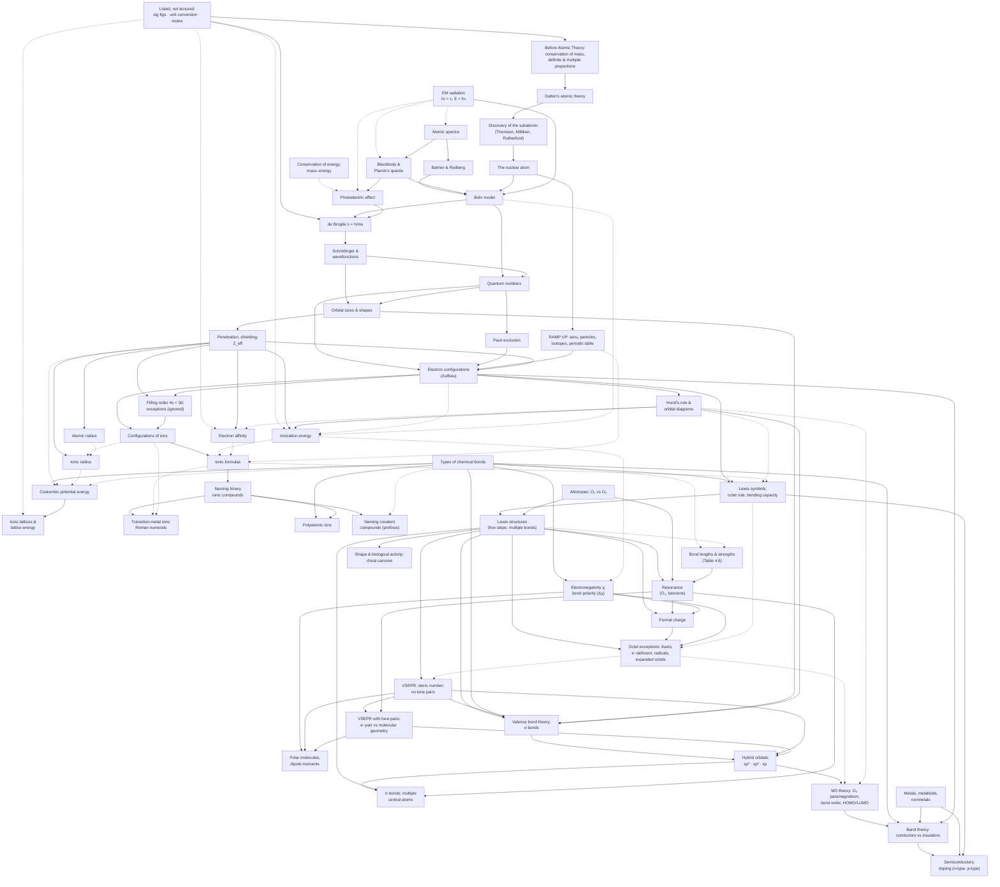

# Course Concept Map

The conceptual dependency structure of THIS course, built only from supplied
materials by `/ingest-course`. Never populate it from a generic chemistry
syllabus or force it into a textbook's chapter order. A concept appears here only
if it appears in lecture, notes, or review material; homework-only concepts go in
the last section.

**Status:** Built from Day 1–11 lecture slides (all 275 pages inspected). No notes,
review, or homework supplied yet. Last updated 2026-10-05 (Day 9–11 added).

## How to read this map

- `A → B` means B depends on A (A is a prerequisite for B).
- Each edge has a basis:
  - **SOURCE-DERIVED** — the materials connect them explicitly (e.g. "recall from
    Day 3…", or B's worked example uses A) — cite it
  - **INFERRED** — B cannot be done without A, but the materials don't say so
- Concept names match the `##` concept headings in `materials/COURSE_INDEX.md`.
- Page citations: `Day N p.X` = `materials/lectures/Day N Lecture Slides.pdf`, PDF page X.

## Units (in course order)

Units follow the professor's own chapter slides (Ch. 1 → 5). Lectures run
continuously, so one lecture can span two units.

### Matter and Atomic Theory (Ch. 1) — Day 1
- Before Atomic Theory: Conservation of Mass, Constant Composition, and Multiple Proportions (Day 1 p.8–13)
- Dalton's Atomic Theory (Day 1 p.14)
- Conservation of Energy and Mass–Energy (Day 1 p.15)
- Listed but Not Lectured: Ch. 1 §1.3–1.8 and Ch. 2 §2.2–2.5 Topics (Day 1 p.6–7, p.16–17; Day 2 p.4–5, p.24). Includes significant figures, unit conversion and dimensional analysis, moles and molar mass, and nuclide symbols. Printed in italic and delegated to RAMP UP ([INFERRED]); used later without being taught.

### Atoms, Ions, and Molecules (Ch. 2, §2.1 lectured) — Day 1 p.16 – Day 2 p.24
- The Discovery of the Subatomic: Thomson, Millikan, and Rutherford (Day 1 p.18–20; Day 2 p.6–18)
- The Nuclear Atom (Day 2 p.17–20)
- RAMP UP Content: Atomic Mass Units, Subatomic Particles, Isotopes, and the Periodic Table (Day 2 p.21–24)

### Atomic Structure: Explaining the Properties of Elements (Ch. 3) — Day 2 p.25 – Day 7 p.11
- Electromagnetic Radiation: Wavelength, Frequency, and Energy (Day 2 p.28–30; Day 3 p.12)
- Atomic Spectra: The Solar Spectrum, Emission, and Absorption (Day 2 p.31; Day 3 p.7–11)
- Blackbody Radiation and Planck's Quantization of Energy (Day 3 p.11–17)
- The Photoelectric Effect (Day 3 p.18–19)
- The Hydrogen Spectrum: Balmer and Rydberg Equations (Day 3 p.21; Day 4 p.6–8)
- The Bohr Model of the Hydrogen Atom (Day 4 p.3, p.8–10; Day 6 p.8)
- The de Broglie Equation: Wave–Particle Duality of Matter (Day 4 p.11–17)
- The Schrödinger Equation and Wavefunctions (Day 4 p.18; Day 5 p.7–9)
- Quantum Numbers (n, ℓ, m_ℓ, m_s) (Day 5 p.10–16)
- The Pauli Exclusion Principle (Day 5 p.15)
- Sizes and Shapes of Atomic Orbitals (Day 5 p.17–20)
- Electron Configurations: The Aufbau Principle and Notation (Day 6 p.6–17)
- Penetration, Shielding, and Effective Nuclear Charge (Z_eff) (Day 6 p.12–13, p.18)
- Hund's Rule and Orbital Diagrams (Day 6 p.15–17)
- Filling Order beyond n = 2 (4s before 3d) and Exceptions to the Filling Rules (Day 6 p.18–20; Day 7 p.6). The exceptions are explicitly excluded: "We will *completely ignore this* in this class" (Day 7 p.6).
- Electron Configurations of Ions (Day 6 p.21–23)
- Periodic Trends: Atomic Radius (Day 6 p.24–26; Day 7 p.7)
- Periodic Trends: Ionic Radius (Day 7 p.8)
- Periodic Trends: Ionization Energy (Day 7 p.9–10)
- Periodic Trends: Electron Affinity (Day 7 p.11)

### Chemical Bonding (Ch. 4) — Day 7 p.12 – Day 9 p.30
- Primary Types of Chemical Bonds (Ionic, Covalent, Metallic) (Day 7 p.14; Day 8 p.11, p.14–15)
- Electrostatic (Coulombic) Potential Energy (Day 7 p.15)
- Ionic Lattices and Lattice Energy (Day 7 p.16–17)
- Formulas of Ionic Compounds (Day 7 p.18–20)
- Naming Binary Ionic Compounds (Day 7 p.21; Day 8 p.6)
- Transition-Metal Ions: Roman Numerals in Names (Day 8 p.7, p.10)
- Polyatomic Ions (Day 8 p.8–9)
- Naming Covalent Compounds (Day 8 p.12–13)
- Lewis Symbols and the Octet Rule (Day 8 p.16–18)
- Lewis Structures of Molecular Compounds (Day 8 p.19–26, p.28–30; Day 9 p.6, p.19–20)
- Allotropes: O₂ and O₃ (Day 8 p.27)
- Resonance (Day 9 p.6–13)
- The Lengths and Strengths of Covalent Bonds (Day 9 p.7, p.14; Day 8 p.11)
- Electronegativity and Bond Polarity (Day 9 p.15–18; Day 10 p.27)
- Formal Charge (Day 9 p.19–26)
- Exceptions to the Octet Rule (Day 9 p.27–30)

### Bonding Theories: Explaining Molecular Geometry (Ch. 5) — Day 10 p.4 – Day 12 p.13
- Molecular Shape and Biological Activity: Chiral Molecules (Day 10 p.3, p.6)
- VSEPR Theory: Steric Number and Central Atoms with No Lone Pairs (Day 10 p.7–13)
- VSEPR: Central Atoms with Lone Pairs (Electron-Pair vs. Molecular Geometry) (Day 10 p.14–26)
- Polar Molecules: Bond Dipoles and Molecular Dipole Moments (Day 10 p.27–31; Day 11 p.6–8)
- Valence Bond Theory: Orbital Overlap and Sigma (σ) Bonds (Day 11 p.9–11)
- Hybrid Orbitals (sp³, sp², sp) and Steric Number (Day 11 p.11–16, p.20, p.24)
- Pi (π) Bonds: Double and Triple Bonds and Molecules with Multiple "Central" Atoms (Day 11 p.17–26)
- Molecular Orbital Theory: O₂ Paramagnetism, Bond Order, HOMO and LUMO (Day 11 p.27; Day 12 p.4–13)

### The Solid State (Ch. 18, §18.4–18.5 only) — Day 12 p.14–25
- Metals, Metalloids, and Nonmetals: Properties of Metals (Day 12 p.14–17)
- Band Theory: Conductors and Insulators (Day 12 p.18–24)
- Semiconductors and Doping (Day 12 p.18, p.24–25)

## Dependency chains

1. **History of the atom:** Before Atomic Theory (laws) → Dalton's Atomic Theory → Discovery of the Subatomic → The Nuclear Atom → Bohr Model → Quantum Numbers (n).
2. **Quantum spine (Day 3 → Day 7):** Atomic Spectra → Planck's Quantization → Photoelectric Effect → de Broglie → Schrödinger Wavefunctions → Quantum Numbers → Pauli → Electron Configurations → Configurations of Ions → Formulas of Ionic Compounds → Naming Binary Ionic Compounds.
3. **Hydrogen line spectrum:** Atomic Spectra (H emission) → Balmer and Rydberg → Bohr ΔE equation → hydrogen's first ionization energy (1312 kJ/mol, Day 7 p.9; [VERIFICATION] 2.178 × 10⁻¹⁸ J × N_A).
4. **Why the periodic trends exist:** Wavefunctions → Sizes and Shapes of Orbitals (radial distributions) → Penetration, Shielding, Z_eff → Filling Order, and the four periodic trends (atomic radius, ionic radius, IE, EA).
5. **Ionic bonding:** Types of Chemical Bonds → Coulombic Potential Energy → Lattice Energy; in parallel, Configurations of Ions → Formulas of Ionic Compounds → Naming.
6. **Unlectured prerequisite toolkit:** Listed but Not Lectured (unit conversion, sig figs, moles) → de Broglie worked examples, every quantitative answer, and all kJ/mol quantities.
7. **Naming:** Formulas of Ionic Compounds → Naming Binary Ionic Compounds → Transition-Metal Roman Numerals and Polyatomic Ions (the same cation-then-anion rule) → Naming Covalent Compounds (the same parent-element and -ide wording, plus prefixes).
8. **Covalent bonding and Lewis structures:** Valence electrons (Electron Configurations) → Lewis Symbols and the Octet Rule (bonding capacity) → Lewis Structures (single, then double and triple bonds; five steps) → Allotropes (O₃) → the topics announced on Day 8 p.26 and taught on Day 9 (chain 9).
9. **Advanced Lewis structures (Day 9):** Lewis Structures (O₃) → Resonance, with bond lengths as the evidence (Lengths and Strengths, Table 4.6) → Formal Charge, which ranks non-equivalent resonance structures using electronegativity → Exceptions to the Octet Rule, where expanded octets are justified by formal charges "closer to zero."
10. **Bond polarity to molecular polarity:** Types of Chemical Bonds → Electronegativity and Bond Polarity (Δχ, Day 9) → Polar Molecules, which also needs the VSEPR shape (Day 10 p.27–31; Day 11 p.6–8).
11. **Shape and bonding theories (Ch. 5):** Lewis Structures → VSEPR, no lone pairs → VSEPR with lone pairs → Polar Molecules. In parallel, Lewis Structures + VSEPR's steric number + orbital shapes + the H–H curve → Valence Bond Theory (σ) → Hybrid Orbitals (SN = number of hybrids) → π Bonds (multiple central atoms; benzene's delocalized π ↔ resonance) → MO theory, announced because all three theories fail for O₂'s paramagnetism (Day 11 p.27) and taught on Day 12 p.6–13, ending with which theory answers which question (Day 12 p.13).
12. **Bonding in solids (Day 12):** MO theory (one MO per atomic orbital; bonding below, antibonding above; HOMO and LUMO) → Band Theory: Na₂ → Na₄ → Na_N, where the HOMO–LUMO gap shrinks until the levels form a band (Day 12 p.19–22) → conductors (a partially filled band, Na; or a filled band overlapping an empty one, Zn) vs. insulators (a large gap) → Semiconductors and Doping (a small gap; T↑; P donor and Ga acceptor levels, Day 12 p.24–25). Inputs: the electron sea (Day 8 p.14), electron configurations (Na 3s¹, Zn 4s²), Lewis symbols (Day 12 p.25), and the metalloids (Day 12 p.16, p.18).

## Edge list

| Prerequisite | → Dependent concept | Basis | Evidence (file p.) |
|---|---|---|---|
| Before Atomic Theory (laws) | Dalton's Atomic Theory | SOURCE-DERIVED | Day 1 p.14: "an explanation for all three of these Laws" |
| Dalton's Atomic Theory | Discovery of the Subatomic | SOURCE-DERIVED | Day 1 p.18; Day 2 p.12: the atom-as-smallest-unit idea "was *disproved*" |
| Discovery of the Subatomic | The Nuclear Atom | SOURCE-DERIVED | Day 2 p.14–19 (gold foil → nucleus) |
| The Nuclear Atom | RAMP UP Content (amu, particles, isotopes, periodic table) | SOURCE-DERIVED | Day 2 p.21–23 continue under the title "The Nuclear Atom" |
| Listed but Not Lectured (sig figs) | Before Atomic Theory (laws) | SOURCE-DERIVED | Day 1 p.11: worked answer 11.2% at 3 s.f. uses sig-fig rules |
| Listed but Not Lectured (unit conversion) | de Broglie | SOURCE-DERIVED | Day 4 p.11–12: g → kg and 1 J = 1 kg·m²/s² inside the worked example |
| Listed but Not Lectured (moles) | Ionization Energy; Electron Affinity; Lattice Energy | INFERRED | Day 7 p.9–17 give kJ/mol values with no mole discussion |
| Conservation of Energy and Mass–Energy | Photoelectric Effect | INFERRED | energy bookkeeping KE = hν − φ (Day 3 p.19) |
| Electromagnetic Radiation | Atomic Spectra | INFERRED | spectra plotted against wavelength (Day 3 p.9–10) on the Day 2 p.29–30 scale |
| Electromagnetic Radiation | Blackbody and Planck | INFERRED | Planck's E = hν (Day 3 p.17) uses the frequency defined on Day 2 p.30 |
| Electromagnetic Radiation | Photoelectric Effect | INFERRED | KE = hν − φ uses photon energy hν (Day 3 p.19) |
| Atomic Spectra | Blackbody and Planck | SOURCE-DERIVED | Day 3 p.11: classical physics couldn't explain the spectra; Kirchhoff's blackbody work "prompted… Planck's hypothesis" |
| Blackbody and Planck | Photoelectric Effect | SOURCE-DERIVED | Day 3 p.18: blackbody "was the ONLY phenomenon… Enter… the photoelectric effect" |
| Atomic Spectra | Balmer and Rydberg | SOURCE-DERIVED | Day 3 p.21; Day 4 p.6: "Recall the hydrogen emission spectrum we saw from Bunsen and Kirchhoff" |
| Balmer and Rydberg | Bohr Model | SOURCE-DERIVED | Day 4 p.7–8, p.10: "In 1913, Niels Bohr made the connection" |
| Blackbody and Planck | Bohr Model | SOURCE-DERIVED | Day 4 p.8: "he borrowed the brave leap from Planck" |
| The Nuclear Atom | Bohr Model | SOURCE-DERIVED | Day 4 p.8: "trying to understand Rutherford's nuclear model of the atom" |
| Electromagnetic Radiation | Bohr Model | SOURCE-DERIVED | Day 4 p.10: E = hν = hc/λ written beside ΔE |
| Bohr Model | de Broglie | SOURCE-DERIVED | Day 4 p.15–16: "physical justification for the quantized orbit radii in Bohr's model" |
| Photoelectric Effect | de Broglie | SOURCE-DERIVED | Day 4 p.11: matter's duality "just as had been shown for light" |
| de Broglie | Schrödinger and Wavefunctions | SOURCE-DERIVED | Day 5 p.7: wavefunctions "describe the wave-particle duality of the electrons" |
| Bohr Model | Quantum Numbers | SOURCE-DERIVED | Day 5 p.10–11: n "is *like* Bohr's single quantum number… it IS Bohr's quantum number" (one electron) |
| Schrödinger and Wavefunctions | Quantum Numbers | SOURCE-DERIVED | Day 5 p.10: orbitals are "independent solutions to the Schrödinger equation… described by three quantum numbers" |
| Quantum Numbers | Pauli Exclusion Principle | SOURCE-DERIVED | Day 5 p.15: "no two electrons can have the exact same set of four quantum numbers" |
| Schrödinger and Wavefunctions | Sizes and Shapes of Orbitals | SOURCE-DERIVED | Day 5 p.8, p.17: Ψ² (probability density) → orbitals; "what do these wavefunctions LOOK like" |
| Quantum Numbers | Sizes and Shapes of Orbitals | SOURCE-DERIVED | Day 5 p.12, p.17–20: ℓ sets shape; three p and five d orbitals match the m_ℓ counts |
| Quantum Numbers | Electron Configurations | SOURCE-DERIVED | Day 6 p.6: "communicate the quantum numbers of all electrons" |
| Pauli Exclusion Principle | Electron Configurations | SOURCE-DERIVED | Day 6 p.6: first of the three rules |
| RAMP UP Content (periodic table) | Electron Configurations | SOURCE-DERIVED | Day 6 p.1 "Have A Periodic Table Handy!!!"; p.9–11 "How many electrons does … have?" |
| Sizes and Shapes of Orbitals | Penetration, Shielding, Z_eff | SOURCE-DERIVED | Day 6 p.12, p.18: radial-distribution graphs used to explain penetration |
| Penetration, Shielding, Z_eff | Electron Configurations | SOURCE-DERIVED | Day 6 p.11–14: Li's third electron goes to 2s, not 2p, "due to penetration" |
| Electron Configurations | Hund's Rule and Orbital Diagrams | SOURCE-DERIVED | Day 6 p.15–16: "But carbon has a second p electron. Where does it go?" |
| Penetration, Shielding, Z_eff | Filling Order and Exceptions | SOURCE-DERIVED | Day 6 p.18–19: 3s < 3p < 3d "due to penetration"; 4s < 3d |
| Electron Configurations | Filling Order and Exceptions | SOURCE-DERIVED | Day 6 p.18–20; Day 7 p.6: "NOT the ones we would predict from the rules we learned on Monday" |
| Electron Configurations | Electron Configurations of Ions | SOURCE-DERIVED | Day 6 p.21: "formed by adding electrons to or removing them from the electron configuration of the parent" |
| Filling Order and Exceptions | Electron Configurations of Ions | SOURCE-DERIVED | Day 6 p.21: Ni loses 4s² before 3d "regardless of the order in which they were added" |
| Penetration, Shielding, Z_eff | Atomic Radius; Ionic Radius; Ionization Energy; Electron Affinity | SOURCE-DERIVED | Day 7 p.5 (bold outcome 7): "Use atomic orbitals and effective nuclear charge to predict periodic trends" |
| Hund's Rule and Orbital Diagrams | Ionization Energy | SOURCE-DERIVED | Day 7 p.9: orbital-box diagram O → O⁺ drawn with the IE definition |
| Electron Configurations (valence vs. core) | Ionization Energy (successive IEs) | INFERRED | Day 7 p.10 red staircase line; explained in TB PDF p.161 |
| Hund's Rule and Orbital Diagrams | Electron Affinity | INFERRED | Day 7 p.11: N +7 circled; half-filled 2p explanation in TB PDF p.164 |
| Electron Configurations of Ions | Ionic Radius | INFERRED | Day 7 p.8 atom/ion pairs |
| Atomic Radius | Ionic Radius | INFERRED | Day 7 p.7–8 shown back to back, each ion beside its atom |
| Bohr Model | Ionization Energy | INFERRED | Day 4 p.10 "Ionization" arrow n = 1 → ∞ ↔ Day 7 p.9 H IE₁ = 1312 kJ/mol ([VERIFICATION] matches 2.178 × 10⁻¹⁸ J × N_A) |
| Types of Chemical Bonds | Coulombic Potential Energy | SOURCE-DERIVED | Day 7 p.14–15: ionic bonds "defined by electrostatic attraction" → E_el equation |
| Penetration, Shielding, Z_eff | Coulombic Potential Energy | INFERRED | "Coulombic attraction" on Day 6 p.12 ↔ E_el on Day 7 p.15 |
| Ionic Radius | Coulombic Potential Energy | INFERRED | d = r₊ + r₋ (TB PDF p.183); not stated on the slides |
| Coulombic Potential Energy | Lattice Energy | SOURCE-DERIVED | Day 7 p.17: "even more stable than we might expect from our two-body equation for Coulombic attractions" |
| Electron Configurations of Ions | Formulas of Ionic Compounds | SOURCE-DERIVED | Day 7 p.18–19: ions "acquire a noble gas electron configuration" |
| Ionization Energy; Electron Affinity | Formulas of Ionic Compounds | INFERRED | metals lose and nonmetals gain electrons; the trends come right before ion formation (Day 7 p.9–19) |
| RAMP UP Content (periodic table groups) | Formulas of Ionic Compounds | INFERRED | Day 7 p.19 groups the charges by column (Li⁺, Na⁺ "But" Mg²⁺, Al³⁺; Cl⁻, F⁻, O²⁻) |
| Formulas of Ionic Compounds | Naming Binary Ionic Compounds | SOURCE-DERIVED | Day 7 p.20 → p.21: "But also magnesium chloride!" (same compounds) |
| Naming Binary Ionic Compounds | Transition-Metal Ions: Roman Numerals | SOURCE-DERIVED | Day 8 p.6 → p.7: after the binary rule, "Many transition metals have more than one common ion!… so we need to be able to *name* them differently" |
| Formulas of Ionic Compounds | Transition-Metal Ions: Roman Numerals | INFERRED | the metal's charge comes from charge balance (Top Hat Fe₂O₃, Day 8 p.10) |
| Electron Configurations of Ions | Transition-Metal Ions: Roman Numerals | INFERRED | transition-metal cations such as Ni²⁺ and V³⁺ (Day 6 p.21–23) come in more than one charge |
| Primary Types of Chemical Bonds | Polyatomic Ions | SOURCE-DERIVED | Day 8 p.8: "several non-metal atoms covalently bonded together, but with an overall charge" |
| Naming Binary Ionic Compounds | Polyatomic Ions | SOURCE-DERIVED | Day 8 p.9 applies the same rule: "LiNO₃ is lithium nitrate…" |
| Naming Binary Ionic Compounds | Naming Covalent Compounds | SOURCE-DERIVED | Day 8 p.12 repeats p.6's "parent element… ending changed to –ide" and adds prefixes |
| Primary Types of Chemical Bonds | Naming Covalent Compounds | INFERRED | a compound must be recognized as covalent (nonmetals, Day 7 p.14) before prefixes apply |
| Primary Types of Chemical Bonds | Lewis Symbols and the Octet Rule | SOURCE-DERIVED | Day 8 p.16: "atoms form bonds by **sharing pairs of electrons**" |
| Electron Configurations (valence electrons) | Lewis Symbols and the Octet Rule | SOURCE-DERIVED | Day 8 p.17: dots represent "**valence** electrons… This is LIKE putting electrons into s and p orbitals" |
| Hund's Rule and Orbital Diagrams | Lewis Symbols and the Octet Rule | INFERRED | "one at a time before pairing" (Day 8 p.17) mirrors "refrain from 'pairing' electrons until we HAVE to" (Day 6 p.16) |
| Formulas of Ionic Compounds | Lewis Symbols and the Octet Rule | INFERRED | ions "acquire a noble gas electron configuration" (Day 7 p.18) ↔ the octet rule's "gain, lose, or share electrons" to "mimic the valence electron configuration of noble gases" (Day 8 p.16) |
| Lewis Symbols and the Octet Rule | Lewis Structures of Molecular Compounds | SOURCE-DERIVED | Day 8 p.19–21: F₂ drawn from two Lewis symbols; step 2 uses "the largest **bonding capacity**" |
| Allotropes: O₂ and O₃ | Lewis Structures of Molecular Compounds | SOURCE-DERIVED | Day 8 p.27 → p.28: O₂ vs. O₃, then "Practice Exercise: Ozone, O₃" |
| Primary Types of Chemical Bonds (covalent H–H curve) | Electrostatic (Coulombic) Potential Energy | INFERRED | the Day 8 p.11 H–H curve has the same attraction–minimum–repulsion shape as the ion-pair curve (Day 7 p.15) |
| Lewis Structures of Molecular Compounds | Resonance | SOURCE-DERIVED | Day 9 p.6–8: the O₃ practice structures → "Which of these structures is correct?" → "in resonance" |
| Allotropes: O₂ and O₃ | Resonance | SOURCE-DERIVED | Day 9 p.6–7: ozone is the first resonance example |
| The Lengths and Strengths of Covalent Bonds | Resonance | SOURCE-DERIVED | Day 9 p.7: O₃'s 128 pm against typical O–O 148 and O=O 121 pm is the evidence for resonance |
| Primary Types of Chemical Bonds (covalent H–H curve) | The Lengths and Strengths of Covalent Bonds | INFERRED | Day 8 p.11's 74 pm and 436 kJ/mol are Table 4.6's H–H row (Day 9 p.14) |
| Lewis Structures of Molecular Compounds | The Lengths and Strengths of Covalent Bonds | INFERRED | Table 4.6 groups bonds by bond order (–, =, ≡), which is read from the Lewis structure (Day 9 p.14) |
| Primary Types of Chemical Bonds | Electronegativity and Bond Polarity | SOURCE-DERIVED | Day 9 p.15–18: electrons in covalent bonds "didn't have to be shared **equally**"; one scale from Cl₂ (nonpolar covalent) to NaCl (ionic) |
| Periodic Trends: Ionization Energy | Electronegativity and Bond Polarity | INFERRED | χ rises across a row and falls down a group like IE₁ (Day 9 p.17 vs. Day 7 p.9); the textbook draws the comparison (TB PDF p.187), the slides don't |
| Lewis Structures of Molecular Compounds | Formal Charge | SOURCE-DERIVED | Day 9 p.19–22: three valid N₂O structures from the five steps, then "To choose between them, we will introduce the idea of **formal charge**" |
| Resonance | Formal Charge | SOURCE-DERIVED | Day 9 p.24: "Formal charge calculations for the resonance structures of N₂O"; p.21's "again, the answer is 'none of them'" echoes p.7 |
| Electronegativity and Bond Polarity | Formal Charge | SOURCE-DERIVED | Day 9 p.23, rule 3: negative formal charges go on "the more/most electronegative element" |
| Lewis Structures of Molecular Compounds | Exceptions to the Octet Rule | SOURCE-DERIVED | Day 8 p.26 "Sometimes it is **impossible** for every atom to have an octet" → Day 9 p.27–29 |
| Formal Charge | Exceptions to the Octet Rule | SOURCE-DERIVED | Day 9 p.29–30: "An expanded shell produces a structure whose atoms' formal charges are closer to zero" (SO₄²⁻: S +2 → 0) |
| Electronegativity and Bond Polarity | Exceptions to the Octet Rule | SOURCE-DERIVED | Day 9 p.29: octets expand around "strongly electronegative elements (F, O, and Cl)" |
| Lewis Symbols and the Octet Rule | Exceptions to the Octet Rule | INFERRED | Be and B are electron-deficient because of their bonding capacities (·Be·, three dots on B; Day 8 p.17–18 ↔ Day 9 p.27) |
| Lewis Structures of Molecular Compounds | Molecular Shape and Biological Activity: Chiral Molecules | SOURCE-DERIVED | Day 10 p.6: "Molecular geometries are clearly more complicated than Lewis structures" |
| Lewis Structures of Molecular Compounds | VSEPR: No Lone Pairs | SOURCE-DERIVED | Day 10 p.7–8: "*Sometimes* Lewis structures are enough…"; "to know the electron-pair geometry, you must have a valid Lewis structure!" |
| Exceptions to the Octet Rule | VSEPR: No Lone Pairs | INFERRED | the SN 3, 5, and 6 examples BF₃, PF₅, SF₆ (Day 10 p.10, p.12) are Day 9's electron-deficient and expanded-octet cases (Day 9 p.27–30) |
| VSEPR: No Lone Pairs | VSEPR: Lone Pairs | SOURCE-DERIVED | Day 10 p.14: "Now let's consider ozone", the same SN reasoning extended to lone pairs |
| Resonance | VSEPR: Lone Pairs | SOURCE-DERIVED | Day 10 p.14–15: both O₃ resonance structures give SN 3, a trigonal planar electron-pair geometry, and a bent molecule |
| Electronegativity and Bond Polarity | Polar Molecules | SOURCE-DERIVED | Day 10 p.27–31: "Polar Bonds" (the Day 9 picture), then each bond's Δχ |
| VSEPR: No Lone Pairs | Polar Molecules | SOURCE-DERIVED | Day 10 p.29–30: the dipoles of linear CO₂ and tetrahedral CF₄ are "perfectly opposed" |
| VSEPR: Lone Pairs | Polar Molecules | SOURCE-DERIVED | Day 10 p.31: bent H₂O's dipoles are "**not** perfectly opposed"; NH₃ in Table 5.2 (Day 11 p.8) |
| Lewis Structures of Molecular Compounds | Valence Bond Theory | SOURCE-DERIVED | Day 11 p.9: "VSEPR grew out of Lewis structures, which pre-date our understanding of atomic orbitals. Can we reconcile the two ideas?" |
| VSEPR: No Lone Pairs | Valence Bond Theory | SOURCE-DERIVED | Day 11 p.9 (same quote); p.11: "We need four equivalent bonds pointing to the vertices of a tetrahedron!" |
| Primary Types of Chemical Bonds (covalent H–H curve) | Valence Bond Theory | SOURCE-DERIVED | Day 11 p.9: "We talked about this already in the context of the H-H potential energy surface" (the Day 8 p.11 curve) |
| Sizes and Shapes of Atomic Orbitals | Valence Bond Theory | SOURCE-DERIVED | Day 11 p.10–11: overlapping H 1s spheres; carbon's 2s sphere and 2p lobes |
| Hund's Rule and Orbital Diagrams | Valence Bond Theory | SOURCE-DERIVED | Day 11 p.11: carbon's ground-state box diagram with two unpaired 2p electrons |
| Valence Bond Theory | Hybrid Orbitals | SOURCE-DERIVED | Day 11 p.11–12: "we pretty quickly run into trouble… Pauling got around this by suggesting the idea of hybridization" |
| VSEPR: No Lone Pairs (steric number) | Hybrid Orbitals | SOURCE-DERIVED | Day 11 p.12: "the number of hybridized orbitals equals the steric number of the atom"; p.24 "Hybridization Based on Steric Number" |
| VSEPR: Lone Pairs | Hybrid Orbitals | SOURCE-DERIVED | Day 11 p.16: the lone pairs of NH₃ and H₂O sit in sp³ orbitals |
| Hybrid Orbitals | π Bonds | SOURCE-DERIVED | Day 11 p.18–20: sp² plus one unhybridized p; "π bonds always result from side-to-side overlap of unhybridized orbitals" |
| Lewis Structures of Molecular Compounds | π Bonds | SOURCE-DERIVED | Day 11 p.17: "Pauling was also able to explain those mysterious double bonds in our Lewis structures" |
| Resonance | π Bonds | SOURCE-DERIVED | Day 11 p.26: benzene's two Kekulé structures (↔) drawn beside its delocalized π cloud |
| Hybrid Orbitals | MO Theory | SOURCE-DERIVED | Day 11 p.27: "Lewis structures, VSEPR, and valence bond/hybridization theories ALL fail to predict this", O₂'s paramagnetism; Day 12 p.7: MO theory "takes the “scrambling” effect of valence bond/hybridization theory to the extreme … Just as with hybridization, we'll get one molecular orbital out for every atomic orbital that we put in" |
| Exceptions to the Octet Rule | MO Theory | INFERRED | unpaired electrons: radicals (Day 9 p.28) ↔ "Only molecules with unpaired electrons are paramagnetic" (Day 11 p.27) |
| Hund's Rule and Orbital Diagrams | MO Theory | INFERRED | Fig. 5.50 puts B₂'s two π2p electrons and O₂'s two π*2p electrons in separate equal-energy orbitals (Day 12 p.11); the slide doesn't name Hund's rule |
| MO Theory | Band Theory: Conductors and Insulators | SOURCE-DERIVED | Day 12 p.19–22: "MO Theory: Na2", "MO Theory: Na4", then Na_N, where the HOMO–LUMO gap disappears; the textbook: band theory "is an extension of molecular orbital theory" (TB PDF p.918) |
| Primary Types of Chemical Bonds (metallic) | Band Theory | SOURCE-DERIVED | Day 8 p.14: the electron sea "begins to account for the conductivity of metals, but that's all we'll say here in Chapter 4"; TB PDF p.918: the sea-of-electrons model fits, "but a more sophisticated approach, called band theory, better explains" |
| Metals, Metalloids, and Nonmetals | Band Theory | SOURCE-DERIVED | Day 12 p.17 → p.18: metals are "Heat and electricity conductors", then "Insulators vs. Conductors" |
| Electron Configurations | Band Theory | SOURCE-DERIVED | TB PDF p.918–919: Na [Ne]3s¹ gives a half-filled 3s band, Zn [Ar]3d¹⁰4s² a filled 4s band (the Na_N and Zn_N figures, Day 12 p.22–23) |
| Band Theory | Semiconductors and Doping | SOURCE-DERIVED | Day 12 p.18: "And then there are the metalloids…"; p.24: "Semiconductor (silicon)" with a small gap, and "T ↑" |
| Metals, Metalloids, and Nonmetals | Semiconductors and Doping | SOURCE-DERIVED | Day 12 p.16 (the metalloids colored on the periodic table) and p.18 |
| Lewis Symbols and the Octet Rule | Semiconductors and Doping | SOURCE-DERIVED | Day 12 p.25: the Lewis symbols ·Si·, ·P·, and ·Ga· beside the n-type and p-type band diagrams |

## Diagram

Regenerate from the edge list whenever edges change. Dashed arrows = INFERRED.

## Cross-topic connections

Where the course revisits an earlier concept in a new context. Cite both places.

- **E = hν** is introduced with λν = c (Day 2 p.30), becomes Planck's quantum (Day 3 p.17), drives the photoelectric effect (Day 3 p.19), gives the photon energy for Bohr transitions (E = hν = hc/λ, Day 4 p.10), and reappears as the photon in the professor's ionization equation M(g) + hν → M⁺(g) + e⁻ (Day 7 p.9).
- **Ionization**: the Bohr diagram's "Ionization" arrow from n = 1 to n = ∞ (Day 4 p.10) ↔ hydrogen's IE₁ = 1312 kJ/mol (Day 7 p.9). [VERIFICATION] 2.178 × 10⁻¹⁸ J × 6.022 × 10²³ mol⁻¹ = 1312 kJ/mol.
- **Removing electrons with light**: photoelectric ejection from a metal surface (Day 3 p.18–19) ↔ ionization of isolated gaseous atoms (Day 7 p.9). [CLARIFICATION: the work function belongs to a solid surface, IE to a gas-phase atom.]
- **Coulombic attraction**: why 2s is lower in energy than 2p (Day 6 p.12) ↔ the E_el equation (Day 7 p.15) ↔ lattice energy (Day 7 p.17).
- **Radial distributions**: 1s/2s/3s plots (Day 5 p.17–18) ↔ penetration graphs for 2s/2p and 3s/3p/3d (Day 6 p.12, p.18).
- **Bohr's n**: the Bohr atom (Day 4 p.9) ↔ its physical meaning via de Broglie standing waves (Day 4 p.16) ↔ the principal quantum number (Day 5 p.10–11) ↔ the Bohr-atom reprise before configurations (Day 6 p.8).
- **Diffraction**: electron vs. X-ray diffraction (Day 4 p.17) ↔ MacGillavry's X-ray crystallography on a Representation Matters slide (Day 5 p.4).
- **Atomic-radius figure**: first shown Day 6 p.24, whose Top Hat ranking went unasked (Day 6 p.26), then repeated Day 7 p.7; atomic vs. ionic radii side by side (Day 7 p.8).
- **Valence electrons**: defined for Li (Day 6 p.14) ↔ the red staircase in successive IEs (Day 7 p.10) ↔ "Cations… lose [their] valence electrons" (Day 7 p.18).
- **Noble-gas configurations**: condensed cores [He]/[Ne] and F⁻ = [Ne] (Day 6 p.14–21) ↔ ions "acquire a noble gas electron configuration" (Day 7 p.18).
- **Pairing and half-filled subshells**: Hund's rule (Day 6 p.16) ↔ O loses its paired 2p electron (Day 7 p.9) ↔ N's positive EA circled in red (Day 7 p.11).
- **Periodic table**: RAMP UP basics (Day 2 p.24) ↔ blocks and filling order (Day 6 p.20) ↔ trends (Day 7 p.7–11) ↔ ion charges by group (Day 7 p.19); "Have a periodic table handy!" (Day 5 p.1; Day 6 p.1; Day 7 p.1).
- **Two energy curves**: the ion-pair E_el curve (Day 7 p.15) ↔ the covalent H–H curve, −436 kJ/mol at 74 pm (Day 8 p.11). Both show attraction, a minimum at the bond distance, and repulsion.
- **Valence electrons, again**: Day 6 p.14 ↔ Lewis dots "representing **valence** electrons" (Day 8 p.17) ↔ "Each copper atom shares its valence electrons with ALL its neighbors" (Day 8 p.14).
- **Don't pair early**: Hund's rule (Day 6 p.16) ↔ Lewis symbols, dots placed "one at a time before pairing" (Day 8 p.17).
- **Ozone**: Molina and Rowland's CFC paper (Representation Matters, Day 8 p.2) ↔ the allotropes O₂ vs. O₃ and the ozone layer (Day 8 p.27) ↔ the ozone Lewis structure (Day 8 p.28–30).
- **Systematic vs. historical names**: copper (II) oxide vs. cupric oxide (Day 8 p.7); "the systematic name for Fe₂O₃" (Day 8 p.10); ethyne vs. acetylene (Day 8 p.24).
- **Table 4.2 lattice energies**: on screen Day 7 p.17–21 and again Day 8 p.6.
- **Energy signs**: ΔE < 0 for emission (Day 4 p.10) ↔ IE₁ always + (Day 7 p.9) ↔ EA₁ ± (Day 7 p.11) ↔ negative lattice energy U (Day 7 p.17) and E_el < 0 for attraction (Day 7 p.15) ↔ the H–H well at −436 kJ/mol (Day 8 p.11) vs. the positive bond energy 436 kJ/mol in Table 4.6 (Day 9 p.14).
- **Ozone, four lectures running**: Molina and the ozone layer (Day 8 p.2) ↔ allotropes (Day 8 p.27) ↔ its Lewis structures (Day 8 p.28–30) ↔ resonance and the hybrid (Day 9 p.6–10) ↔ bent at 117° from SN 3 with one lone pair (Day 10 p.14–15).
- **The H–H curve, three times**: the covalent bond (Day 8 p.11) ↔ Table 4.6's H–H row, 74 pm and 436 kJ/mol (Day 9 p.14) ↔ the start of valence bond theory (Day 11 p.9).
- **Benzene**: Lonsdale's crystallography (Day 9 p.2) ↔ Kekulé's structures and the resonance hybrid (Day 9 p.12–13) ↔ the delocalized π cloud (Day 11 p.26).
- **Formaldehyde**: H–C–H about 118° because a double bond repels more (Day 10 p.13) ↔ sp² C and O, σ + π (Day 11 p.17–19).
- **Ammonia**: Lewis structure and the hidden "tetrahedral" callout (Day 8 p.22–23) ↔ tetrahedral electron-pair geometry, trigonal pyramidal at 107° (Day 10 p.16–18) ↔ polar, 1.47 D (Day 11 p.8) ↔ sp³ with a lone pair (Day 11 p.16).
- **Water**: bent at 104.5° (Day 10 p.19) ↔ polar, Δχ 1.4 (Day 10 p.31; Day 11 p.6) ↔ 1.85 D (Day 11 p.8) ↔ sp³ with two lone pairs (Day 11 p.16).
- **CO₂**: "*Sometimes* Lewis structures are enough" (Day 10 p.7) ↔ SN 2, linear (Day 10 p.10) ↔ polar bonds but a nonpolar molecule (Day 10 p.28–29) ↔ Table 4.6's footnote, C=O 799 kJ/mol in CO₂ (Day 9 p.14).
- **Octet exceptions reappear in VSEPR**: BCl₃ and AlCl₃ (Day 9 p.27) ↔ BF₃, SN 3 (Day 10 p.10); PCl₅ and SF₆ (Day 9 p.29–30) ↔ PF₅ and SF₆, SN 5 and 6 (Day 10 p.12).
- **Unpaired electrons**: Hund's rule (Day 6 p.16) ↔ radicals NO and NO₂ (Day 9 p.28) ↔ Gerschman's free radicals (Day 11 p.3) ↔ carbon's two unpaired electrons (Day 11 p.11) ↔ paramagnetic O₂ (Day 11 p.27) ↔ O₂'s two π*2p electrons circled in red (Day 12 p.11).
- **Electronegativity at work**: the Δχ cutoffs (Day 9 p.18) ↔ formal-charge rule 3 (Day 9 p.23) ↔ expanded octets with F, O, Cl (Day 9 p.29) ↔ bond dipoles with their Δχ (Day 10 p.29–31).
- **Steric number ↔ hybridization**: SN (Day 10 p.9) ↔ "the number of hybridized orbitals equals the steric number" (Day 11 p.12) ↔ "Hybridization Based on Steric Number" (Day 11 p.24).
- **The battery analogy for a polar bond**: Day 9 p.15 ↔ Day 10 p.27.
- **MO diagrams to bands**: H₂ and the period-2 diatomics (Day 12 p.8–11) ↔ Na₂ and Na₄ and their HOMO–LUMO gap (Day 12 p.19–21) ↔ the Na_N and Zn_N bands (Day 12 p.22–23).
- **Why metals conduct, twice**: the electron sea (Day 7 p.14; Day 8 p.14) ↔ "Heat and electricity conductors" (Day 12 p.17) ↔ partially filled or overlapping bands (Day 12 p.18, p.22–24).
- **Lewis symbols, again**: dots for valence electrons (Day 8 p.16–17) ↔ ·Si·, ·P·, ·Ga· counting the dopants' valence electrons (Day 12 p.25).
- **Which model when**: Lewis for connectivity, VSEPR or VBT for 3-D shape, MO for magnetic or spectroscopic properties (Day 12 p.13) ↔ the three theories that "ALL fail" for O₂ (Day 11 p.27).

## Scope boundaries stated in lecture

- [SOURCE-DERIVED] Schrödinger-equation mathematics: "beyond the scope of this class" (Day 5 p.7).
- [SOURCE-DERIVED] Exceptions to the filling rules (e.g., Mo [Kr]5s¹4d⁵): "We will *completely ignore this* in this class" (Day 7 p.6).
- [SOURCE-DERIVED] Periodic table, isotopes, ions, nuclide symbols: delegated to RAMP UP (Day 2 p.24).
- [SOURCE-DERIVED] Historical names for transition-metal ions: "we're not going to worry about them" (Day 8 p.7).
- [SOURCE-DERIVED] Polyatomic ions: a table is provided on exams, "so you don't need to memorize them" (Day 8 p.8).
- [SOURCE-DERIVED] Metallic bonding: "that's all we'll say here in Chapter 4" (Day 8 p.14).
- [SOURCE-DERIVED] Announced on Day 8 (electronegativity, formal charge, resonance, for cases where octets are impossible or several Lewis structures are valid, Day 8 p.26) and taught on Day 9 (p.6–30).
- [SOURCE-DERIVED] Why delocalized electrons stabilize a molecule: "For reasons beyond the scope of this class" (Day 9 p.10).
- [SOURCE-DERIVED] Hypervalency "is not well understood" (Day 9 p.29): no mechanism for expanded octets is taught.
- [SOURCE-DERIVED] Molecular orbital theory is to be covered "briefly" (Day 11 p.27); it took Day 12 p.6–13, with diatomics only (H₂ through Ne₂).
- [SUPPORTED EMPHASIS] "Ramp Up IS on this exam" (Day 10 p.2; Day 11 p.2): the Day 2 p.24 RAMP UP topics are Midterm 1 content.
- [SOURCE-DERIVED] Not bold on any chapter slide so far: §4.9 (vibrating bonds, greenhouse effect), §5.6 (chirality; grey on Day 12 p.4), and Ch. 5 outcome 5 (Day 9 p.4; Day 10 p.4–5; Day 11 p.4–5; Day 12 p.4–5). §5.7 and outcome 4 became bold on Day 12 p.4–5.
- [SOURCE-DERIVED] Ch. 18: only §18.4–18.5 and outcome 3 are bold (Day 12 p.14–15); §18.1–18.3 and §18.6–18.9 (structures of metals, alloys, nonmetals, ionic solids, ceramics, X-ray diffraction) are listed plain, so [INFERRED] not taught.
- [SOURCE-DERIVED] Greyed out on the chapter slides: COAST (§1.2), §1.9, mass spectrometry (§2.6) (Day 1 p.6, p.16–17). Meaning not stated → [UNCERTAIN].

## Homework-only concepts

Concepts appearing in homework but not in lecture/notes/review. NOT course scope
until lecture or review material supports them; flag them to the student.

(none — no homework files have been supplied; see `materials/HOMEWORK_INDEX.md`)
